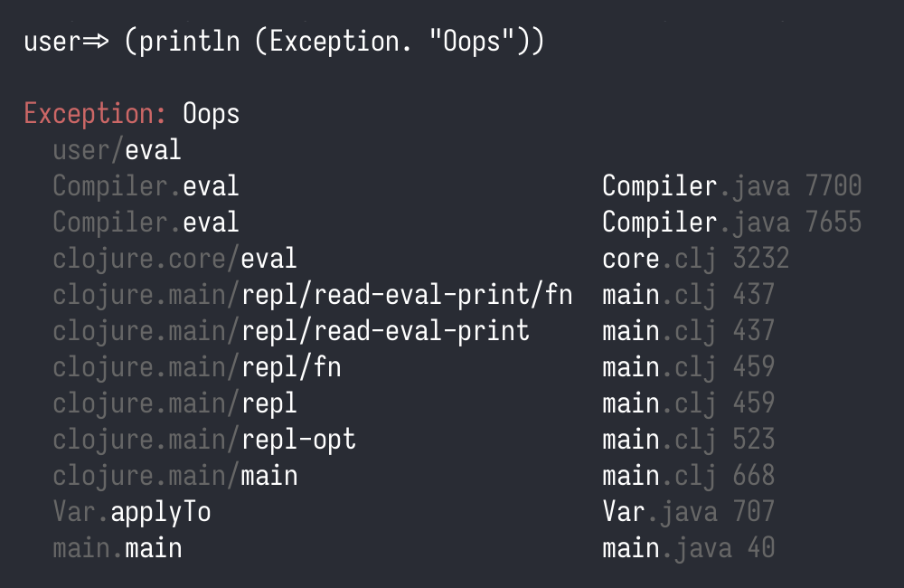
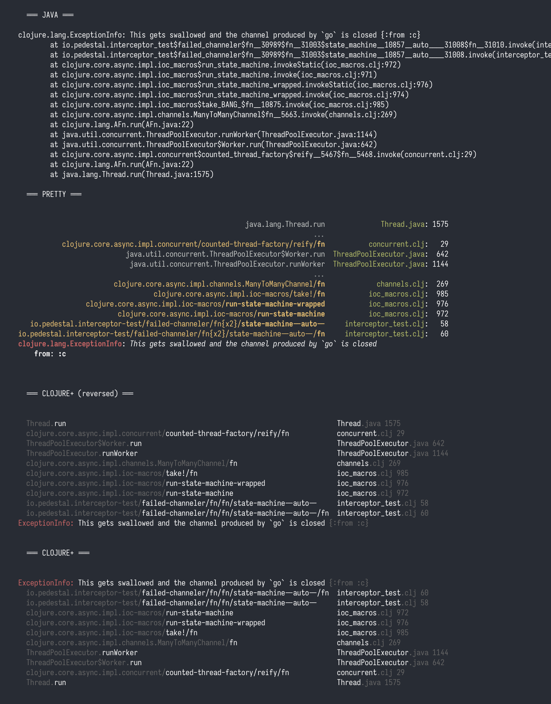

# Clojure Plus

A collection of utilities that improve Clojure experience.

## Using

Add this to deps.edn:

```clojure
io.github.tonsky/clojure-plus {:mvn/version "1.1.0"}
```

## clojure+.core

### if+

Allows sharing local variables between condition and then clause.

Use `:let [...]` form (not nested!) inside `and` condition and its bindings will be visible in later `and` clauses and inside `then` branch:

```clojure
(if+ (and
       (= 1 2)
       ;; same :let syntax as in doseq/for
       :let [x 3
             y (+ x 4)]
       ;; x and y visible downstream
       (> y x))
  
  ;; “then” branch: x and y visible here!
  (+ x y 5)
  
  ;; “else” branch: no x nor y
  6)
```

Note: `:let`-declared vars are only visible inside `then` branch because they ultimately depend on all conditions to be true. That lets you do things like:

```clojure
(if+ (and
       (some? x)
       :let [f (.-f x)]
       (= :... f))
  ...)
```

This will be quite inconvenient to solve using normal `if` and `let`, as it would require you to duplicate `<else>` clause:

```clojure
(if (some? x)
  (let [f (.-f x)]
    (if (= :... f)
      <then>
      <else>))
  <else>)
```

Another asymmetry is `and` vs `or`: `:let` only works insid top-level `and` condition.

### when+

Same as `if+`, but wraps body in implicit `do`:


```clojure
(when+ (and
         (= 1 2)
         ;; same :let syntax as in doseq/for
         :let [x 3
               y (+ x 4)]
         ;; x and y visible downstream
         (> y x))
  
  ;; body: x and y visible here!
  (+ x y 5))
```

### cond+

Cond on steroids.
   
Define new variables between conditions:

```clojure
(cond+
  false   :false
  :let    [x 1]
  (= 1 x) (str x)) ; => \"1\"
```

Insert imperative code:

```clojure
(cond+
  (= 1 a) :false
  :do     (println a) ; will print 1 before continuing evaluating
  :else   :true)
```

Declare variables inside conditions, just like if+:

```clojure
(cond+
  (and
    (= 1 1)
    ;; declare new vars inside `and` condition
    :let [x 2
          y (+ x 1)]
    ;; use them downstream in the same condition
    (> y x))
  ;; matching branch sees them too
  [x y]) ;; => [2 3]
```

## clojure+.print

Clojure does a stellar job printing built-in datastructures like maps, vectors, lists and records. Everything else looks... less elegant. Up to 1.6 it at least looked compact:

```clojure
=> (atom 42)
#<Atom@2fc0cc3: 42>

=> (io/file "/")
#<File />

=> *ns*
#<Namespace user>
```

But 1.7 made it too noisy:

```clojure
=> (atom 123)
#object[clojure.lang.Atom 0x23c650a3 {:status :ready, :val 123}]

=> (io/file "/")
#object[java.io.File 0x7d2a6eac "/"]

=> *ns*
#object[clojure.lang.Namespace 0x3961a41a "user"]

=> (transient [1 2 3])
#object[clojure.lang.PersistentVector$TransientVector 0x41c89d2f "clojure.lang.PersistentVector$TransientVector@41c89d2f"]
```

Atom is one of the core primitives of the language, and yet it lacks good print representation. Same for other things: arrays, refs, transients, namespaces, files, futures, java.time objects etc.

This library solves this!

```clojure
=> (atom 123)
#atom 123

=> (io/file "/")
#file "/"

=> *ns*
#ns user

=> (transient [1 2 3])
#transient [1 2 3]
```

Seeing things this clearly greatly improves day-to-day Clojure experience. If you expect these things, sure, you can take steps and print them. But more often than not they just pop in random places, during REPL explorations, debug printing etc. It’s sooooo nice to just see what they are. Right away. With no extra preparation.

Seeing into arrays is especially nice:

```clojure
user=> (int-array [1 2 3])
; before
#object["[I" 0x595f4da5 "[I@595f4da5"]
; after
#ints [1 2 3]
```

Reader tags also make constructing things easier:

```clojure
; before
(java.nio.file.Path/of "/" (make-array String 0))
(into clojure.lang.PersistentQueue/EMPTY [1 2 3])

; after
#path "/"
#queue [1 2 3]
```

To enable all this, just:

```clojure
(require 'clojure+.print)
(clojure+.print/install!)
```

You can pass `:include`/`:exclude` options or choose to intall only readers or only printers:

```clojure
(clojure+.print/install-printers! {:include ['queue 'file]})
(clojure+.print/install-readers! {:exclude ['bytes 'ns]})
```

Note: this representation doesn't track identity. So printing `atom` and reading it back will produce a new object instance. Same goes for arrays, transients etc.

### Is it safe?

Technically, reader tags with no namespace are reserved by Clojure. I see two possible uses:

1. Use them during development only. Install printers in `user.clj` and see your data clearly during REPL evaluations and debug output. That alone will get you 90% of the benefits already. Aestethics matters.

2. Fully commit and use reader tags while writing code. Potentially, new version of Clojure might introduce conflicting tags, so be aware of that. Maybe don’t do it in a library (something people might reuse), but in your own project? Why not? If Clojure breaks compatibility in the future, you can always clean it up and keep going.

### What types are supported?

Arrays:

```
byte[]                #bytes "CAFEBABE"
boolean[]             #booleans [true false]
char[]                #chars [\a \b \c]
short[]               #shorts [1 2 3]
int[]                 #ints [1 2 3]
long[]                #longs [1 2 3]
float[]               #floats [1.0 2.0 3.5]
double[]              #doubles [1.0 2.0 3.5]
String[]              #strings ["a" "b" "c"]
Object[]              #objects [nil nil]
Other arrays          #array ^java.io.File/1 [#file ...]
                      #array ^String/2 [["a"] ["b" "c"]]
```

References:

```
Atom                  #atom 123
Agent                 #agent 123
Ref                   #ref 123
Volatile              #volatile 123
Reduced               #reduced 123
Promise               #promise <pending...>
                      #promise 123
Delay                 #delay <pending...>
                      #delay 123
Future                #future <pending...>
                      #future 123
SoftReference         #soft-ref #object[...]
WeakReference         #weak-ref #object[...]
AtomicBoolean         #atomic-boolean true
AtomicInteger         #atomic-int 123
AtomicLong            #atomic-long 123
AtomicReference       #atomic-ref #object[...]
AtomicIntegerArray    #atomic-ints [1 2 3]
AtomicLongArray       #atomic-longs [1 2 3]
AtomicReferenceArray  #atomic-refs [#object[...] ...]
```

Data structures:

```
PersistentQueue       #queue [1 2 3]
Transients            #transient [1 2 3]
                      #transient {:a 1 :b 2}
                      #transient #{:a :b :c}
```

Functions:

```
AFunction             #fn clojure.core/+
                      #fn clojure+.print/fn--25647/f1--25648
MultiFn               #multifn print-method
```

java.time:

```
Duration              #duration "PT12H30M59S"
Instant               #instant "2025-02-20T02:58:07.703Z"
LocalDate             #local-date "2025-02-20"
LocalDateTime         #local-date-time "2025-02-20T02:58:07.703"
LocalTime             #local-time "02:58:07.703"
MonthDay              #month-day "--02-29"
OffsetDateTime        #offset-date-time "2025-02-20T02:58:07.703Z"
OffsetTime            #offset-time "02:58:07.703Z"
Period                #period "P2Y3M4D"
Year                  #year 2025
YearMonth             #year-month "2025-02"
ZonedDateTime         #zoned-date-time "2025-02-20T02:58:07.703+01:00[Europe/Berlin]"
ZoneId                #zone-id "Europe/Berlin"
ZoneOffset            #zone-offset "+03:45"
DayOfWeek             #day-of-week :wednesday
Month                 #month :february
ChronoUnit            #chrono-unit :seconds
```

And the rest:

```
File                  #file "/"
Path                  #path "/"
Namespace             #ns clojure+.print
Thread                #thread [35 "clojure-agent-send-off-pool-1"]
                      ^:virtual #thread [36 "vvv"]
InetAddress           #inet-address "127.0.0.1"
                      #inet-address "1080:0:0:0:8:800:200c:417a"
URL                   #url "https://example.com"
URI                   #uri "https://example.com"
TimeUnit              #time-unit :seconds
Charset               #charset "UTF-8"
```

Ideas to what else would be convenient to print are welcome!

This namespace was inspired by Ivan Grishaev’s [taggie](https://github.com/igrishaev/taggie).

## clojure+.error

Clojure exception printer is hard to look at:

```clojure
user=> (println (Exception. "Oops"))
#error {
 :cause Oops
 :via
 [{:type java.lang.Exception
   :message Oops
   :at [user$eval3 invokeStatic NO_SOURCE_FILE 1]}]
 :trace
 [[user$eval3 invokeStatic NO_SOURCE_FILE 1]
  [user$eval3 invoke NO_SOURCE_FILE 1]
  [clojure.lang.Compiler eval Compiler.java 7700]
  [clojure.lang.Compiler eval Compiler.java 7655]
  [clojure.core$eval invokeStatic core.clj 3232]
  [clojure.core$eval invoke core.clj 3228]
  [clojure.main$repl$read_eval_print__9244$fn__9247 invoke main.clj 437]
  [clojure.main$repl$read_eval_print__9244 invoke main.clj 437]
  [clojure.main$repl$fn__9253 invoke main.clj 459]
  [clojure.main$repl invokeStatic main.clj 459]
  [clojure.main$repl_opt invokeStatic main.clj 523]
  [clojure.main$main invokeStatic main.clj 668]
  [clojure.main$main doInvoke main.clj 617]
  [clojure.lang.RestFn invoke RestFn.java 400]
  [clojure.lang.AFn applyToHelper AFn.java 152]
  [clojure.lang.RestFn applyTo RestFn.java 135]
  [clojure.lang.Var applyTo Var.java 707]
  [clojure.main main main.java 40]]}
```

And I mean it in a literal sense: information is hard to parse, it’s not easy to find what you are looking for, labels don’t make sense. Why is message repeated twice? Why is it called `:cause` first time and `:message` second time? What are `:via` and `:at`? Why is it nested like this?

Compare to Java:

```clojure
user=> (.printStackTrace (Exception. "Oops"))
java.lang.Exception: Oops
        at user$eval5.invokeStatic(NO_SOURCE_FILE:1)
        at user$eval5.invoke(NO_SOURCE_FILE:1)
        at clojure.lang.Compiler.eval(Compiler.java:7700)
        at clojure.lang.Compiler.eval(Compiler.java:7655)
        at clojure.core$eval.invokeStatic(core.clj:3232)
        at clojure.core$eval.invoke(core.clj:3228)
        at clojure.main$repl$read_eval_print__9244$fn__9247.invoke(main.clj:437)
        at clojure.main$repl$read_eval_print__9244.invoke(main.clj:437)
        at clojure.main$repl$fn__9253.invoke(main.clj:459)
        at clojure.main$repl.invokeStatic(main.clj:459)
        at clojure.main$repl_opt.invokeStatic(main.clj:523)
        at clojure.main$main.invokeStatic(main.clj:668)
        at clojure.main$main.doInvoke(main.clj:617)
        at clojure.lang.RestFn.invoke(RestFn.java:400)
        at clojure.lang.AFn.applyToHelper(AFn.java:152)
        at clojure.lang.RestFn.applyTo(RestFn.java:135)
        at clojure.lang.Var.applyTo(Var.java:707)
        at clojure.main.main(main.java:40)
```

Much cleaner! I often call `.printStackTrace` on exceptions just to understand what’s going on.

My second problem is that Clojure exception printer doesn’t know about Clojure. Why do I see `clojure.main$repl_opt invokeStatic` when what I wrote in code is `(clojure.main/repl-opt)`?

Clojure+ solves all these problems! Here’s how _the same_ exception looks in Clojure+:

```clojure
user=> (println (Exception. "Oops"))
Exception: Oops
  user/eval
  Compiler.eval                         Compiler.java 7700
  Compiler.eval                         Compiler.java 7655
  clojure.core/eval                     core.clj 3232
  clojure.main/repl/read-eval-print/fn  main.clj 437
  clojure.main/repl/read-eval-print     main.clj 437
  clojure.main/repl/fn                  main.clj 459
  clojure.main/repl                     main.clj 459
  clojure.main/repl-opt                 main.clj 523
  clojure.main/main                     main.clj 668
  Var.applyTo                           Var.java 707
  main.main                             main.java 40
```

I just want to highlight: this is exactly the same stacktrace, but cleaned up and formatted better. It is Clojure-aware: stack trace elements that are clearly coming from Clojure are decoded back to familiar form.

There’re couple more tricks. For those of us with colored terminal, we can help you read output even better:



We can print readably:

```clojure
user=> (prn (Exception. "Oops"))

#error {
 :class   java.lang.Exception
 :message "Oops"
 :trace
 [[user/eval]
  [Compiler.eval                         "Compiler.java" 7700]
  [Compiler.eval                         "Compiler.java" 7655]
  [clojure.core/eval                     "core.clj" 3232]
  [clojure.main/repl/read-eval-print/fn  "main.clj" 437]
  [clojure.main/repl/read-eval-print     "main.clj" 437]
  [clojure.main/repl/fn                  "main.clj" 459]
  [clojure.main/repl                     "main.clj" 459]
  [clojure.main/repl-opt                 "main.clj" 523]
  [clojure.main/main                     "main.clj" 668]
  [Var.applyTo                           "Var.java" 707]
  [main.main                             "main.java" 40]]}
```

The trick here is that you can be both _readable_ (in Clojure `(read)` sense) and still nicely formatted.

Finally, for long exceptions, I always found it irritating that you need to scroll up to see message and where that error started. Well, no more: `clojure+.error` can reverse stack traces:

```clojure
user=> (clojure+.error/install! {:reverse? true})
user=> (println (Exception. "Oops"))

  main.main                             main.java 40
  Var.applyTo                           Var.java 707
  clojure.main/main                     main.clj 668
  clojure.main/repl-opt                 main.clj 523
  clojure.main/repl                     main.clj 459
  clojure.main/repl/fn                  main.clj 459
  clojure.main/repl/read-eval-print     main.clj 437
  clojure.main/repl/read-eval-print/fn  main.clj 437
  clojure.core/eval                     core.clj 3232
  Compiler.eval                         Compiler.java 7655
  Compiler.eval                         Compiler.java 7700
  user/eval
Exception: Oops
```

This way you always see what happened without need to scroll.

Oh, and we support `ExceptionInfo`, that goes without saying:

```clojure
user=> (println (ex-info "Oops" {:a 1, :b 2}))

  main.main                             main.java 40
  Var.applyTo                           Var.java 707
  clojure.main/main                     main.clj 668
  clojure.main/repl-opt                 main.clj 523
  clojure.main/repl                     main.clj 459
  clojure.main/repl/fn                  main.clj 459
  clojure.main/repl/read-eval-print     main.clj 437
  clojure.main/repl/read-eval-print/fn  main.clj 437
  clojure.core/eval                     core.clj 3232
  Compiler.eval                         Compiler.java 7655
  Compiler.eval                         Compiler.java 7700
  user/eval
ExceptionInfo: Oops {:a 1, :b 2}
```

Good news? All this is configurable! Here are the defaults:

```clojure
(clojure+.error/install!
  {:clean?           true
   :collapse-common? true
   :color?           true
   :reverse?         false
   :root-cause-only? false
   :indent           2})
```

Comparison with [pretty](https://github.com/clj-commons/pretty):



And if you don’t like it, you can always restore the default printer:

```clojure
(clojure+.error/uninstall!)
```

## clojure+.walk

A drop-in replacement for `clojure.walk` that does not recreate data structures if they didn’t change (result of transform funcion is `identical?`)

Normally, `clojure.walk` will create new map from scratch and copy `:a 1, :b 2` to it:

```clojure
(let [m {:a 1, :b 2}]
  (identical? m (clojure.walk/postwalk identity m)))

;; (into (empty m) (map identity m))
; => false
```

When the structure is deep and everything is recreated, it can be very taxing on GC.

Compare it to:

```clojure
(let [m {:a 1, :b 2}]
  (identical? m (clojure+.walk/postwalk identity m)))

; => true
```

`clojure+.walk` reuses existing maps and `update`s keys that has changed. This works significantly better for transforms that don’t touch some parts of the tree at all, but also utilizes structural sharing for cases when you only update few keys.

## License

Copyright © 2025 Nikita Prokopov

Licensed under [MIT](LICENSE).
